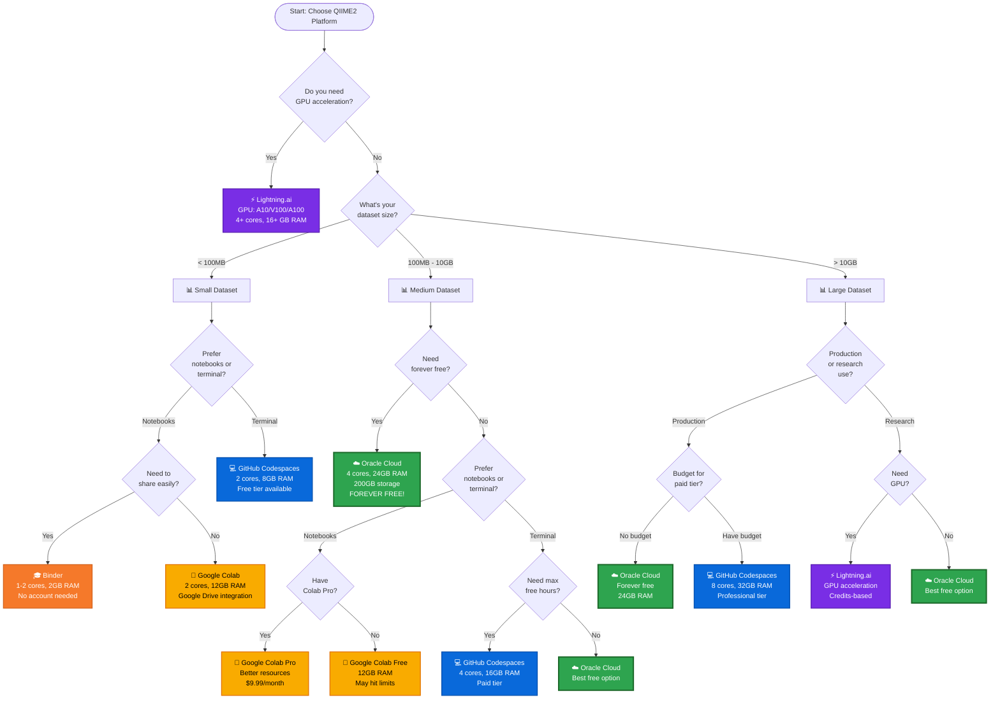
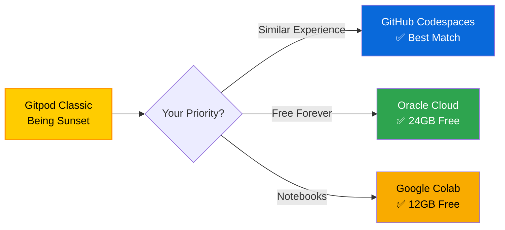

# QIIME2 2025.10 Platform Decision Flowchart

Interactive decision guide to help you choose the right platform for your QIIME2 work.

---

## 🎯 Quick Decision Flowchart



---

## 📊 Detailed Decision Matrix

### By Use Case

| Your Use Case | Best Platform | Why? |
|---------------|--------------|------|
| **Learning QIIME2** | Binder or Google Colab | Free, no setup, tutorials ready |
| **Teaching a class** | Binder | No accounts needed, easy sharing |
| **Research project (small)** | Google Colab | 12GB RAM, Google Drive integration |
| **Research project (large)** | Oracle Cloud | 24GB RAM, forever free |
| **Production pipeline** | Oracle Cloud or GitHub Codespaces | Reliable, persistent |
| **Team collaboration** | GitHub Codespaces | Built-in version control |
| **GPU-heavy work** | Lightning.ai | GPU acceleration |
| **Testing workflows** | Any platform | Choose based on dataset size |
| **Long-running analyses** | Oracle Cloud | No session limits |

### By Dataset Size

| Dataset Size | Recommended | Alternative |
|-------------|-------------|-------------|
| **< 100MB** | Binder (fastest start) | Google Colab |
| **100MB - 1GB** | Google Colab (12GB free) | GitHub Codespaces |
| **1GB - 10GB** | Oracle Cloud (24GB free) | GitHub Codespaces (paid) |
| **10GB - 50GB** | Oracle Cloud | GitHub Codespaces (large) |
| **> 50GB** | Oracle Cloud + block storage | Lightning.ai (with GPU) |

### By Budget

| Budget | Best Options | Notes |
|--------|-------------|-------|
| **$0 (Free Forever)** | Oracle Cloud | 24GB RAM, no time limits |
| **$0 (Free with Limits)** | Google Colab, Binder | Session/resource limits |
| **< $20/month** | GitHub Codespaces | Pay for what you use |
| **$20-100/month** | GitHub Codespaces Pro | Professional tier |
| **Credits-based** | Lightning.ai | Pay per compute hour |

### By Interface Preference

| Preference | Platforms |
|-----------|-----------|
| **Jupyter Notebooks** | Google Colab, Binder |
| **Terminal/CLI** | GitHub Codespaces, Oracle Cloud |
| **Both** | Lightning.ai |
| **Web IDE** | GitHub Codespaces |

---

## 🔀 Alternative Flowchart (Text-Based)

For those who prefer a simple text decision tree:

```
┌─────────────────────────────────────────────────────────┐
│          QIIME2 Platform Selection Guide                │
└─────────────────────────────────────────────────────────┘

START HERE:
│
├─ Do you need GPU acceleration?
│  │
│  ├─ YES → Lightning.ai (GPU: A10/V100/A100)
│  │
│  └─ NO → Continue below
│
├─ What's your dataset size?
│  │
│  ├─ SMALL (< 100MB)
│  │  │
│  │  ├─ Need to share/teach?
│  │  │  ├─ YES → Binder (no account needed)
│  │  │  └─ NO  → Google Colab (better resources)
│  │  │
│  │  └─ Prefer terminal? → GitHub Codespaces
│  │
│  ├─ MEDIUM (100MB - 10GB)
│  │  │
│  │  ├─ Want forever free?
│  │  │  ├─ YES → Oracle Cloud ⭐ (24GB RAM!)
│  │  │  └─ NO  → Google Colab or GitHub Codespaces
│  │  │
│  │  └─ Prefer notebooks? → Google Colab
│  │
│  └─ LARGE (> 10GB)
│     │
│     ├─ Production use?
│     │  ├─ YES → Oracle Cloud (free) or GitHub Codespaces (paid)
│     │  └─ NO  → Oracle Cloud
│     │
│     └─ Need GPU? → Lightning.ai

LEGEND:
⭐ = Recommended
💰 = Paid options available
🆓 = Forever free
```

---

## 🎓 Scenario-Based Recommendations

### Scenario 1: Graduate Student on Budget

**Situation**: Processing medium datasets (2-5GB), need to save results long-term, no budget

**Recommendation**: Oracle Cloud
- ✅ 24GB RAM (plenty for your data)
- ✅ Forever free
- ✅ 200GB storage
- ✅ SSH access for remote work

**Alternative**: Google Colab + Google Drive
- ✅ Free tier adequate
- ✅ Easy Drive integration
- ⚠️ 12-hour session limit

---

### Scenario 2: Teaching Microbiome Course

**Situation**: 30 students, tutorial datasets (<100MB), need quick setup

**Recommendation**: Binder
- ✅ No accounts needed
- ✅ One-click launch
- ✅ Students can't break it
- ✅ Free to use

**Alternative**: Google Colab
- ⚠️ Requires Google accounts
- ✅ Better resources if needed

---

### Scenario 3: Bioinformatics Core Facility

**Situation**: Multiple users, various dataset sizes, need reproducibility

**Recommendation**: GitHub Codespaces
- ✅ Version control built-in
- ✅ Team management
- ✅ Scalable resources
- ✅ Reproducible environments

**Alternative**: Oracle Cloud
- ✅ Free tier for testing
- ✅ Can provision multiple instances

---

### Scenario 4: Machine Learning on Microbiome Data

**Situation**: Need GPU for ML, large feature tables

**Recommendation**: Lightning.ai
- ✅ GPU acceleration (A10/V100/A100)
- ✅ Scalable resources
- ✅ Good for ML workflows

**Alternative**: Google Colab Pro
- ✅ GPU available (T4)
- ✅ $9.99/month
- ⚠️ Session limits

---

### Scenario 5: Production Pipeline

**Situation**: Automated workflows, run nightly, need reliability

**Recommendation**: Oracle Cloud
- ✅ No session timeouts
- ✅ Reliable uptime
- ✅ Can automate with cron
- ✅ Free tier sufficient

**Alternative**: GitHub Codespaces (paid)
- ✅ Better if workflows in Git
- ✅ CI/CD integration

---

## 🔍 Comparison Table

### Feature Comparison

| Feature | Oracle | Codespaces | Colab | Binder | Lightning |
|---------|--------|------------|-------|--------|-----------|
| **Forever Free** | ✅ | ❌ | Tier | ✅ | ❌ |
| **Max Free RAM** | 24GB | 8GB | 12GB | 2GB | - |
| **GPU Available** | ❌ | ❌ | ✅ | ❌ | ✅ |
| **Session Limit** | None | None | 12h | - | Config |
| **Jupyter** | ➖ | ✅ | ✅ | ✅ | ✅ |
| **Terminal** | ✅ | ✅ | ➖ | ➖ | ✅ |
| **Persistent** | ✅ | ✅ | ❌ | ❌ | ✅ |
| **Setup Time** | 15min | 15min | 15min | 25min | 15min |
| **Ideal Dataset** | >1GB | Any | <10GB | <100MB | >10GB |

Legend: ✅ Yes | ❌ No | ➖ Partial/Limited | Tier = Free tier available

---

## 📈 Migration Paths

### From Gitpod Classic



**Recommended Migration**:
1. **If you loved Gitpod** → GitHub Codespaces (most similar)
2. **If budget matters** → Oracle Cloud (forever free, more RAM)
3. **If using notebooks** → Google Colab (easy transition)

---

## 🎯 Quick Recommendations

### By Priority

**Priority: Cost**
1. 🥇 Oracle Cloud (forever free, 24GB)
2. 🥈 Google Colab (free tier, 12GB)
3. 🥉 Binder (free, 2GB)

**Priority: Performance**
1. 🥇 Oracle Cloud (24GB, 4 cores, free!)
2. 🥈 GitHub Codespaces (32GB, 8 cores, paid)
3. 🥉 Lightning.ai (GPU available)

**Priority: Ease of Use**
1. 🥇 Binder (one-click, no account)
2. 🥈 Google Colab (familiar Jupyter)
3. 🥉 GitHub Codespaces (VS Code online)

**Priority: Features**
1. 🥇 GitHub Codespaces (version control, collaboration)
2. 🥈 Lightning.ai (GPU, scalable)
3. 🥉 Google Colab (Drive integration, sharing)

---

## 📞 Still Unsure?

### Decision Helper Questions

Answer YES/NO to find your platform:

1. **Do you have < $10/month budget?**
   - NO → Oracle Cloud or Binder
   - YES → Continue

2. **Do you need > 12GB RAM?**
   - YES → Oracle Cloud (free) or GitHub Codespaces (paid)
   - NO → Continue

3. **Do you prefer Jupyter notebooks?**
   - YES → Google Colab
   - NO → GitHub Codespaces

4. **Do you need GPU?**
   - YES → Lightning.ai or Google Colab Pro
   - NO → Use your answer from above

5. **Is this for teaching?**
   - YES → Binder
   - NO → Use your answer from above

---

## 🔗 Platform Links

Quick access to all platforms:

- **Oracle Cloud**: [Free Tier Signup](https://www.oracle.com/cloud/free/) | [Our Guide](https://github.com/nycmyc/qiime2-amplicon-2025.7-gitpod/tree/claude/oracle-cloud-migration-011CUhtcsjFAvbCA5anHdTqN)
- **GitHub Codespaces**: [Create Codespace](https://github.com/codespaces) | [Our Branch](https://github.com/nycmyc/qiime2-amplicon-2025.7-gitpod/tree/claude/github-codespaces-migration-011CUhtcsjFAvbCA5anHdTqN)
- **Google Colab**: [Launch Notebook](https://colab.research.google.com/github/nycmyc/qiime2-amplicon-2025.7-gitpod/blob/claude/colab-migration-011CUhtcsjFAvbCA5anHdTqN/QIIME2_Setup.ipynb)
- **Binder**: [Launch](https://mybinder.org/v2/gh/nycmyc/qiime2-amplicon-2025.7-gitpod/claude/binder-migration-011CUhtcsjFAvbCA5anHdTqN)
- **Lightning.ai**: [Platform](https://lightning.ai/) | [Our Setup](https://github.com/nycmyc/qiime2-amplicon-2025.7-gitpod/tree/claude/lightning-ai-migration-011CUhtcsjFAvbCA5anHdTqN)

---

## 📊 Visual Resource Comparison

```
Resource Comparison (Free Tiers)

RAM:
Oracle Cloud  ████████████████████████  24 GB 🏆
Google Colab  ████████████              12 GB
GitHub        ████████                   8 GB
Binder        ██                         2 GB

Storage:
Oracle Cloud  ████████████████████████ 200 GB 🏆
Google Colab  ████████████████████     100 GB
GitHub        ████████                  32 GB
Binder        ██                        10 GB

CPU Cores:
Oracle Cloud  ████                       4 🏆
GitHub        ████                       4
Google Colab  ██                         2
Binder        ██                         2

Cost:
All Free!     ✅✅✅✅

Legend: █ = Unit of resource | 🏆 = Best in category
```

---

**Need More Help?**
- View [Platform Comparison](PLATFORM_COMPARISON.md)
- Check [Quick Reference](PLATFORM_QUICK_REFERENCE.md)
- Read [Test Results](TEST_RESULTS.md)

**Ready to Start?**
- [Choose Your Platform](#-quick-decision-flowchart) 🚀

---

**Last Updated**: November 2024
**Platforms**: 6 options available
**All tested and validated**: ✅ 31/31 tests passed
