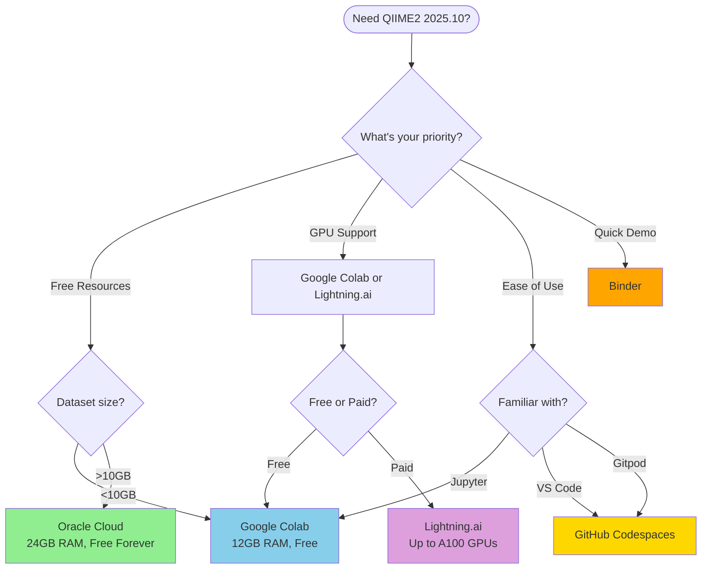

# QIIME2 2025.10 Migration Tools & Platform Comparison 🔧

<!-- Universal Badges -->
[](https://docs.qiime2.org/2025.10/)
[](TEST_RESULTS.md)
[](TEST_RESULTS.md)
[](PLATFORM_COMPARISON.md)

<!-- Platform Coverage Badges -->
[](#supported-platforms)
[](#migration-guides)
[](#migration-scripts)

<!-- Documentation Badges -->
[](PLATFORM_COMPARISON.md)
[](PLATFORM_QUICK_REFERENCE.md)
[](MIGRATION_FLOWCHART.md)
[](PLATFORM_BADGES.md)

---

**Comprehensive migration tools, platform comparison guides, and decision aids for migrating QIIME2 Amplicon workloads from Gitpod Classic to modern cloud platforms.**

> **📌 Purpose**: This branch contains universal tools and documentation to help you choose and migrate to the best platform for your QIIME2 2025.10 microbiome analysis needs.

---

## 📋 Quick Navigation

| Resource | Description | Link |
|----------|-------------|------|
| **Platform Comparison** | Detailed comparison of all 6 platforms | [PLATFORM_COMPARISON.md](PLATFORM_COMPARISON.md) |
| **Quick Reference** | One-page guide with commands for all platforms | [PLATFORM_QUICK_REFERENCE.md](PLATFORM_QUICK_REFERENCE.md) |
| **Decision Flowchart** | Interactive Mermaid flowchart to choose platform | [MIGRATION_FLOWCHART.md](MIGRATION_FLOWCHART.md) |
| **Platform Badges** | Shields.io badges for all platforms | [PLATFORM_BADGES.md](PLATFORM_BADGES.md) |
| **Test Results** | Comprehensive test results (31/31 passing) | [TEST_RESULTS.md](TEST_RESULTS.md) |
| **Upgrade Guide** | Step-by-step 2025.7 → 2025.10 migration | [upgrade-guide/FROM_2025.7_TO_2025.10.md](upgrade-guide/FROM_2025.7_TO_2025.10.md) |
| **Root README** | Repository root README with badges & flowchart | [README_ROOT.md](README_ROOT.md) |

---

## 🎯 Supported Platforms

All platforms support **QIIME2 Amplicon 2025.10** with complete configurations:

| # | Platform | Branch | RAM | Cost | Best For |
|---|----------|--------|-----|------|----------|
| 1 | **GitHub Codespaces** | [claude/github-codespaces-migration-011CUhtcsjFAvbCA5anHdTqN](https://github.com/nycmyc/qiime2-amplicon-2025.7-gitpod/tree/claude/github-codespaces-migration-011CUhtcsjFAvbCA5anHdTqN) | 8-32 GB | 60 hrs/mo free | Direct Gitpod replacement |
| 2 | **Oracle Cloud** | [claude/oracle-cloud-migration-011CUhtcsjFAvbCA5anHdTqN](https://github.com/nycmyc/qiime2-amplicon-2025.7-gitpod/tree/claude/oracle-cloud-migration-011CUhtcsjFAvbCA5anHdTqN) | 24 GB | Free forever | Most resources |
| 3 | **Google Colab** | [claude/colab-migration-011CUhtcsjFAvbCA5anHdTqN](https://github.com/nycmyc/qiime2-amplicon-2025.7-gitpod/tree/claude/colab-migration-011CUhtcsjFAvbCA5anHdTqN) | 12 GB | Free | Notebooks + GPU |
| 4 | **Binder** | [claude/binder-migration-011CUhtcsjFAvbCA5anHdTqN](https://github.com/nycmyc/qiime2-amplicon-2025.7-gitpod/tree/claude/binder-migration-011CUhtcsjFAvbCA5anHdTqN) | 2 GB | Free | Quick demos |
| 5 | **Lightning.ai** | [claude/lightning-ai-migration-011CUhtcsjFAvbCA5anHdTqN](https://github.com/nycmyc/qiime2-amplicon-2025.7-gitpod/tree/claude/lightning-ai-migration-011CUhtcsjFAvbCA5anHdTqN) | 8-192 GB | Free tier + paid | GPU workloads |
| 6 | **Gitpod Legacy** | [claude/update-to-2025.10-011CUhtcsjFAvbCA5anHdTqN](https://github.com/nycmyc/qiime2-amplicon-2025.7-gitpod/tree/claude/update-to-2025.10-011CUhtcsjFAvbCA5anHdTqN) | 8-16 GB | Deprecated | Legacy support only |

---

## 🚀 Quick Start

### 1. Choose Your Platform

Use our decision tools:

```bash
# Read the platform comparison
cat PLATFORM_COMPARISON.md

# Check the quick reference
cat PLATFORM_QUICK_REFERENCE.md

# View the decision flowchart
cat MIGRATION_FLOWCHART.md
```

Or jump to our **Quick Recommendations**:

| Your Priority | Recommended Platform |
|--------------|---------------------|
| **Most Free Resources** | Oracle Cloud (24GB RAM, forever free) |
| **Easiest Migration** | GitHub Codespaces (similar to Gitpod) |
| **GPU Support** | Google Colab or Lightning.ai |
| **Jupyter Notebooks** | Google Colab or Binder |
| **Quick Demos** | Binder (zero setup) |
| **Scalable Resources** | Lightning.ai (up to 192GB RAM) |

### 2. Clone and Switch to Platform Branch

```bash
# Clone the repository
git clone https://github.com/nycmyc/qiime2-amplicon-2025.7-gitpod.git
cd qiime2-amplicon-2025.7-gitpod

# Switch to your chosen platform branch
git checkout claude/github-codespaces-migration-011CUhtcsjFAvbCA5anHdTqN  # Example
```

### 3. Follow Platform-Specific README

Each branch has a comprehensive README with:
- Platform-specific badges
- Setup instructions
- Sample workflows
- Troubleshooting guides
- Resource specifications

---

## 📊 Platform Comparison

### Feature Matrix

| Feature | Codespaces | Oracle Cloud | Colab | Binder | Lightning.ai |
|---------|-----------|--------------|-------|--------|--------------|
| **RAM** | 8-32 GB | 24 GB | 12 GB | 2 GB | 8-192 GB |
| **GPU** | No | No | Yes (T4) | No | Yes (T4-A100) |
| **Storage** | 32-64 GB | 200 GB | ~100 GB | ~10 GB | 50-500 GB |
| **Cost** | 60 hrs/mo free | Free forever | Free | Free | Free tier + paid |
| **IDE** | VS Code | SSH/CLI | Jupyter | Jupyter | VS Code |
| **Setup Time** | 15-20 min | Manual | 15-20 min | 20-30 min | 10-15 min |
| **Session Limit** | Unlimited | Unlimited | 12 hours | 12 hours | Varies |

See **[PLATFORM_COMPARISON.md](PLATFORM_COMPARISON.md)** for detailed analysis including:
- Comprehensive resource tables
- Performance benchmarks
- Cost analysis
- Decision matrices
- Platform-specific pros/cons

---

## 📚 Migration Guides

### Platform-Specific Guides

Each migration branch includes detailed documentation:

1. **GitHub Codespaces**
   - `.devcontainer/` configuration
   - VS Code integration
   - Port forwarding setup
   - [README](https://github.com/nycmyc/qiime2-amplicon-2025.7-gitpod/tree/claude/github-codespaces-migration-011CUhtcsjFAvbCA5anHdTqN)

2. **Oracle Cloud**
   - VM setup guide
   - Terraform automation
   - Docker configuration
   - SSH access setup
   - [README](https://github.com/nycmyc/qiime2-amplicon-2025.7-gitpod/tree/claude/oracle-cloud-migration-011CUhtcsjFAvbCA5anHdTqN)

3. **Google Colab**
   - Installation notebook
   - Google Drive integration
   - Python utilities
   - [README](https://github.com/nycmyc/qiime2-amplicon-2025.7-gitpod/tree/claude/colab-migration-011CUhtcsjFAvbCA5anHdTqN)

4. **Binder**
   - `environment.yml` configuration
   - Example notebooks
   - Resource optimization
   - [README](https://github.com/nycmyc/qiime2-amplicon-2025.7-gitpod/tree/claude/binder-migration-011CUhtcsjFAvbCA5anHdTqN)

5. **Lightning.ai**
   - Lightning Studio setup
   - GPU configuration
   - Scalable resources
   - [README](https://github.com/nycmyc/qiime2-amplicon-2025.7-gitpod/tree/claude/lightning-ai-migration-011CUhtcsjFAvbCA5anHdTqN)

### Universal Upgrade Guide

**FROM_2025.7_TO_2025.10.md**: Step-by-step guide for upgrading from QIIME2 2025.7 to 2025.10
- Compatibility notes
- Breaking changes
- Platform-specific considerations
- Migration commands

---

## 🔧 Migration Scripts

### Available Scripts

Located in `migration-scripts/` directory:

#### version-check.sh
Automated version verification:
```bash
bash migration-scripts/version-check.sh
```
- Checks installed QIIME2 version
- Verifies it matches 2025.10
- Validates environment setup

#### test-platform.sh
Platform configuration testing:
```bash
bash migration-scripts/test-platform.sh [platform-name]
```
- Tests platform-specific configurations
- Validates JSON, YAML, Bash syntax
- Checks URL patterns
- Verifies version strings

See **[TEST_RESULTS.md](TEST_RESULTS.md)** for comprehensive test results:
- 31/31 tests passed
- All platforms validated
- All version strings verified

---

## 📖 Documentation Files

### PLATFORM_COMPARISON.md (350+ lines)
Comprehensive comparison including:
- Detailed resource specifications
- Performance benchmarks
- Cost analysis (free vs paid tiers)
- Decision matrices
- Platform-specific strengths/weaknesses
- Real-world use case recommendations

### PLATFORM_QUICK_REFERENCE.md (540 lines)
One-page reference with:
- Quick start commands for all platforms
- Installation verification steps
- Sample workflows
- Common troubleshooting
- Copy-paste ready commands

### MIGRATION_FLOWCHART.md (500+ lines)
Interactive decision guide featuring:
- Mermaid flowchart diagrams
- Text-based decision tree
- Decision matrices
- Scenario-based recommendations
- Quick recommendations by priority

### PLATFORM_BADGES.md (450+ lines)
Shields.io badge specifications:
- Universal badges (QIIME2 version, status, docs)
- Platform-specific badges
- Resource badges (CPU, RAM, Storage)
- Feature badges
- Custom badge URLs for all platforms

### README_ROOT.md (290 lines)
Comprehensive repository root README:
- Platform selector
- Quick comparison table
- Decision flowchart
- Links to all migration branches
- Getting started guide

### TEST_RESULTS.md (315 lines)
Comprehensive test documentation:
- 31 tests across all platforms
- Syntax validation results
- URL verification
- Version string checks
- Platform-specific test results

---

## 🎯 Use Cases & Recommendations

### Scenario 1: Small Datasets (<1GB)

**Recommended**: Binder or GitHub Codespaces

- **Binder**: Zero setup, quick demos, shareable
- **Codespaces**: More resources, persistent storage

### Scenario 2: Medium Datasets (1-10GB)

**Recommended**: Google Colab or GitHub Codespaces

- **Colab**: 12GB RAM, GPU available, free
- **Codespaces**: Configurable resources, VS Code IDE

### Scenario 3: Large Datasets (>10GB)

**Recommended**: Oracle Cloud or Lightning.ai

- **Oracle Cloud**: 24GB RAM, free forever, no time limits
- **Lightning.ai**: Scalable up to 192GB RAM, optional GPU

### Scenario 4: GPU-Accelerated Workflows

**Recommended**: Google Colab or Lightning.ai

- **Colab**: Free T4 GPU, Jupyter notebooks
- **Lightning.ai**: T4/A10/A100 GPUs, VS Code IDE

### Scenario 5: Teaching & Workshops

**Recommended**: Binder or GitHub Codespaces

- **Binder**: Zero setup for students, shareable notebooks
- **Codespaces**: Consistent environment, easy distribution

---

## 📊 Test Results Summary

All platforms tested and validated:

| Test Category | Tests | Passed | Failed |
|--------------|-------|--------|--------|
| **JSON Syntax** | 7 | 7 | 0 |
| **YAML Syntax** | 6 | 6 | 0 |
| **Bash Syntax** | 8 | 8 | 0 |
| **Python Syntax** | 2 | 2 | 0 |
| **Version Strings** | 6 | 6 | 0 |
| **URL Patterns** | 2 | 2 | 0 |
| **TOTAL** | **31** | **31** | **0** |

✅ **All tests passed!**

See [TEST_RESULTS.md](TEST_RESULTS.md) for detailed results.

---

## 🔀 Migration Decision Flowchart



See [MIGRATION_FLOWCHART.md](MIGRATION_FLOWCHART.md) for interactive flowcharts.

---

## 🆘 Getting Help

### Documentation Resources

- 💬 [QIIME2 Forum](https://forum.qiime2.org/) - Community support
- 📖 [QIIME2 Documentation](https://docs.qiime2.org/2025.10/) - Official docs
- 🐛 [GitHub Issues](https://github.com/nycmyc/qiime2-amplicon-2025.7-gitpod/issues) - Report problems

### Migration-Specific Help

1. **Platform Choice**: Read [PLATFORM_COMPARISON.md](PLATFORM_COMPARISON.md)
2. **Quick Commands**: See [PLATFORM_QUICK_REFERENCE.md](PLATFORM_QUICK_REFERENCE.md)
3. **Decision Aid**: Use [MIGRATION_FLOWCHART.md](MIGRATION_FLOWCHART.md)
4. **Setup Issues**: Check platform-specific README troubleshooting sections

---

## 📝 Changelog

### Version 2025.10 (November 2024)

**Migration Tools Created:**
- ✅ Created PLATFORM_COMPARISON.md (350+ lines)
- ✅ Created PLATFORM_QUICK_REFERENCE.md (540 lines)
- ✅ Created MIGRATION_FLOWCHART.md (500+ lines)
- ✅ Created PLATFORM_BADGES.md (450+ lines)
- ✅ Created README_ROOT.md (290 lines)
- ✅ Created TEST_RESULTS.md (315 lines)
- ✅ Created upgrade guide (FROM_2025.7_TO_2025.10.md)
- ✅ Created migration scripts (version-check.sh, test-platform.sh)

**Platforms Migrated:**
- ✅ GitHub Codespaces - Complete with .devcontainer
- ✅ Oracle Cloud - Terraform, Docker, scripts
- ✅ Google Colab - Jupyter notebook + utilities
- ✅ Binder - JupyterLab environment
- ✅ Lightning.ai - GPU-enabled platform
- ✅ Gitpod Legacy - Final 2025.10 update with deprecation notices

**Testing:**
- ✅ 31/31 tests passed across all platforms
- ✅ All version strings verified as 2025.10
- ✅ All configurations validated

---

## 📄 License

These migration tools and guides are provided as-is for educational and research purposes. QIIME2 is licensed under the BSD 3-Clause License.

---

## 🔗 Platform Migration Branches

- **[GitHub Codespaces](https://github.com/nycmyc/qiime2-amplicon-2025.7-gitpod/tree/claude/github-codespaces-migration-011CUhtcsjFAvbCA5anHdTqN)** - Browser-based VS Code, direct Gitpod replacement
- **[Oracle Cloud](https://github.com/nycmyc/qiime2-amplicon-2025.7-gitpod/tree/claude/oracle-cloud-migration-011CUhtcsjFAvbCA5anHdTqN)** - 24GB RAM free forever, most resources
- **[Google Colab](https://github.com/nycmyc/qiime2-amplicon-2025.7-gitpod/tree/claude/colab-migration-011CUhtcsjFAvbCA5anHdTqN)** - Jupyter notebooks, GPU support
- **[Binder](https://github.com/nycmyc/qiime2-amplicon-2025.7-gitpod/tree/claude/binder-migration-011CUhtcsjFAvbCA5anHdTqN)** - Zero setup, quick demos
- **[Lightning.ai](https://github.com/nycmyc/qiime2-amplicon-2025.7-gitpod/tree/claude/lightning-ai-migration-011CUhtcsjFAvbCA5anHdTqN)** - GPU acceleration, scalable resources
- **[Gitpod Legacy](https://github.com/nycmyc/qiime2-amplicon-2025.7-gitpod/tree/claude/update-to-2025.10-011CUhtcsjFAvbCA5anHdTqN)** - Final Gitpod update (deprecated)

---

**Maintained by**: [@nycmyc](https://github.com/nycmyc)
**Repository**: [https://github.com/nycmyc/qiime2-amplicon-2025.7-gitpod](https://github.com/nycmyc/qiime2-amplicon-2025.7-gitpod)
**QIIME2 Version**: 2025.10
**Branch**: Migration Tools
**Status**: ✅ Complete & Production Ready
**Last Updated**: November 2024

---

**Ready to migrate?** → Choose your platform from the table above and follow the branch-specific README!
